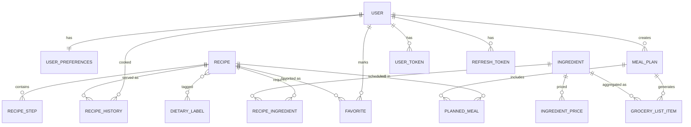

# Recipe App — Entity Model

Sep 22, 2026 · @Someone

Locked entity design for the Java/Spring Boot recipe and meal-planning backend: 12 entities covering user preferences, recipe/ingredient data, and meal-plan generation.

## ER Diagram



Twelve entities: User and UserPreferences sit at the center of personalization, Recipe/RecipeIngredient/Ingredient/DietaryLabel form the recipe catalog, and MealPlan/PlannedMeal/GroceryListItem are what the generator writes to each week.

## User & Preferences

**User** — `id`, `email`, `passwordHash`, `isPremium` (ad-free flag), `createdAt`.

**UserPreferences** (1:1 with User) — everything the generator reads before building a plan:

| Field | Type | Notes |
| --- | --- | --- |
| `weeklyBudget` | decimal | source of truth; per-meal derived from this |
| `householdServingSize` | int | drives recipe scaling by default |
| `dietaryRestrictions` | list of DietaryLabel refs | vegan, gluten-free, etc. |
| `maxCaloriesPerMeal` | int, nullable | toggleable |
| `maxCaloriesPerDay` | int, nullable | toggleable |
| `proteinTargetGrams` | int, nullable | toggleable |
| `otherMacroTargets` | JSONB, nullable | fat/carb targets if enabled |
| `repeatAvoidanceDays` | int | window before a recipe can reappear (checked against RecipeHistory) |

**RecipeHistory** — `id`, `userId` (FK), `recipeId` (FK), `servedAt`. Replaces the earlier banned-ids JSONB idea; powers the repeat-avoidance window and doubles as variety analytics.

**Favorite** — `id`, `userId` (FK), `recipeId` (FK), `createdAt`. Join table feeding the shared-ingredient recommendation weighting.

## Recipe & Ingredient

**Recipe** — `id`, `name`, `description`, `prepTime`, `cookTime`, `totalTime`, `baseServings`, `notes`, `createdAt`.

**RecipeStep** — `id`, `recipeId` (FK), `stepNumber`, `instructionText`.

**RecipeIngredient** (join, Recipe ↔ Ingredient) — `id`, `recipeId` (FK), `ingredientId` (FK), `amount`, `unit`, `isOptional` (bool), `prepNote` (free text — chopped, room temperature, garnish, etc., pulled off the ingredient line during parsing), rawText (the original unparsed ingredient string, kept for reference), needsReview (bool — true when ingredient-matching confidence is low). ingredientId is nullable to support unmatched rows pending review. The `amount`/`unit` pair is what gets multiplied by the serving-scale factor (target servings ÷ `baseServings`) and run through the Indriya unit-conversion layer.

**Ingredient** — the FoodData Central–backed master table: `id`, `fdcId`, `name`, `nutrientsPer100g` (JSONB, normalized from FDC's `foodNutrients`), `commonPortions` (JSONB list of `{modifier, gramWeight}`, from FDC's `foodPortions` — this is the density table for volume↔mass conversion).

**DietaryLabel** — `id`, `name` (vegan, pescatarian, high-protein, etc.), many-to-many with Recipe via a join table. Matched against `UserPreferences.dietaryRestrictions` at query time to filter the candidate pool before the generator runs. Assigned automatically at ingestion via a rule-based decision tree rather than scraped or hand-tagged: an exclusion-list check per label (e.g. vegan fails if any matched ingredient is meat/dairy/egg) and a threshold check for computed traits (e.g. high-protein if protein-per-serving exceeds a set gram cutoff).

**IngredientPrice** — `id`, `ingredient` (FK), `storeName`, `price`, `currency`, `recordedAt`, `source` (enum: `OPEN_PRICES` / `MANUAL`). Sourced primarily from the Open Prices crowdsourced dataset (free, ODbL-licensed, barcode-level — requires its own fuzzy match from barcode product to `Ingredient`), with manual entries as fallback where coverage is thin. `GroceryListItem.estimatedCost` reads the most recent matching row rather than pricing live per-request.

## Meal Planning & Grocery List

**MealPlan** — `id`, `userId` (FK), `weekStartDate`, `budgetTarget` (snapshot of the weekly budget used), `isMealPrepMode`, `createdAt`.

**PlannedMeal** (join, MealPlan ↔ Recipe) — `id`, `mealPlanId` (FK), `recipeId` (FK), `dayOfWeek`, `mealSlot` (breakfast/lunch/dinner), `portionMultiplier`. In meal-prep mode, `portionMultiplier` is derived as `householdServingSize × daysCovered ÷ baseServings` rather than set once — this is the central entity the generator writes to and the calendar view reads from.

**GroceryListItem** — `id`, `mealPlanId` (FK), `ingredientId` (FK), `totalAmount`, `unit`, `estimatedCost`, `purchased` (bool). Generated by aggregating `RecipeIngredient` rows across every `PlannedMeal` in a plan, scaled by each meal's `portionMultiplier`, then priced against the grocery cost API.

## Ingestion Pipeline

A Python script runs `recipe-scrapers` against a URL list and POSTs raw recipes to a Spring Boot ingest endpoint; the Java side owns all parsing, matching, and persistence.

**Request** — `POST /api/admin/recipes/ingest`, API-key protected, batched 25–50 recipes per call:

```json
[{
  "sourceUrl": "https://...",
  "name": "...",
  "prepTimeMinutes": 15,
  "cookTimeMinutes": 30,
  "baseServings": 4,
  "rawIngredients": ["5 tbsp honey (sourwood is nice)"],
  "rawInstructions": ["Preheat oven to 350°F."],
  "imageUrl": "https://..."
}]
```

Nutrition is never trusted from the scrape — it's computed server-side from matched `Ingredient` rows (FoodData Central), avoiding two conflicting sources of truth.

**Response** — per-item status so a re-run is legible:

```json
{ "created": 42, "skippedDuplicate": 8, "failed": [{"sourceUrl": "...", "reason": "..."}], "needsReview": 15 }
```

**Server-side steps per recipe**: dedupe on `sourceUrl` → persist `Recipe`/`RecipeStep` → parse each raw ingredient string (quantity, unit, name, `isOptional`, `prepNote` via regex, with an NYT `ingredient-phrase-tagger`-style fallback for the messy cases) → fuzzy-match the name against `Ingredient` via Postgres `pg_trgm` → low-confidence matches persist with `ingredientId = null, needsReview = true, rawText` kept, rather than a separate review-queue table → run the `DietaryLabel` decision tree against the matched ingredients and computed nutrition.

Synchronous for v1 — low personal-use volume doesn't justify async/queue infrastructure yet.

## Field & Method Reference

**Rule of thumb**: if a method needs a Spring bean (repository, `PasswordEncoder`, external API client), it's a service method, not an entity method — Hibernate instantiates entities outside Spring's bean lifecycle, so they can't cleanly reach into that world. Entity methods should only touch data the entity itself (and its loaded associations) already holds.

Services implied by the entity design so far: `AuthService` (registration/login, owns `PasswordEncoder`), `IngredientPricingService` (owns `IngredientPriceRepository`, backs the `estimatedCostFor`/`estimatedCost` methods pulled off the entities above), `DietaryLabelClassifier` (the ingest-time decision tree), and `MealPlanGeneratorService` (the constraint-satisfaction planner itself).

### User

| Field | Type | Notes |
| --- | --- | --- |
| firstName | String | not null |
| lastName | String | not null |
| id | UUID | PK |
| email | String | unique, not null |
| passwordHash | String | not null |
| isPremium | boolean | default false |
| createdAt | Instant | not null |

**Helpers**: none for hashing/auth — that lives in `AuthService` (injected `PasswordEncoder`), keeping the entity thin. `toPublicView()` → `UserDTO` (omits passwordHash) is safe as an entity method since it only reads the entity's own fields. `isSubscriptionActive()` stays on the entity for the same reason.

### UserPreferences (1:1 User)

| Field | Type | Notes |
| --- | --- | --- |
| id | UUID | PK |
| user | User | FK, not null |
| weeklyBudget | BigDecimal | not null |
| householdServingSize | int | default 1 |
| dietaryRestrictions | List\<DietaryLabel> | M:N |
| maxCaloriesPerMeal | Integer | nullable |
| maxCaloriesPerDay | Integer | nullable |
| proteinTargetGrams | Integer | nullable |
| otherMacroTargets | JSONB | nullable |
| repeatAvoidanceDays | int | default 14 |

**Helpers**: `hasNutritionConstraints()`, `isCompatibleWith(Recipe)` (checks dietary restrictions), `perMealBudget(mealCount)`

### RecipeHistory

| Field | Type | Notes |
| --- | --- | --- |
| id | UUID | PK |
| user | User | FK |
| recipe | Recipe | FK |
| servedAt | Instant | not null |

**Helpers**: `isWithinAvoidanceWindow(days)`

### Favorite

| Field | Type | Notes |
| --- | --- | --- |
| id | UUID | PK |
| user | User | FK |
| recipe | Recipe | FK |
| createdAt | Instant | not null |

**Helpers**: none — pure join, similarity scoring lives in the recommendation service, not the entity

### Recipe

| Field | Type | Notes |
| --- | --- | --- |
| id | UUID | PK |
| name | String | not null |
| description | String | nullable |
| prepTimeMinutes | int |  |
| cookTimeMinutes | int |  |
| totalTimeMinutes | int | derived, or stored on ingest |
| baseServings | int | not null |
| notes | String | nullable |
| createdAt | Instant | not null |

**Helpers**: `scaleIngredientsTo(targetServings)` → List\<ScaledIngredient>, `nutritionPerServing()`, `matchesAllRestrictions(List\<DietaryLabel\>)` — all pure, operate only on already-loaded associations. `estimatedCostFor(servings)` moves to `IngredientPricingService` instead, since pricing needs a repository lookup against `IngredientPrice`, not just this entity's own fields.

### RecipeStep

| Field | Type | Notes |
| --- | --- | --- |
| id | UUID | PK |
| recipe | Recipe | FK |
| stepNumber | int | not null |
| instructionText | String | not null |

**Helpers**: none

### RecipeIngredient (join, Recipe ↔ Ingredient)

| Field | Type | Notes |
| --- | --- | --- |
| id | UUID | PK |
| recipe | Recipe | FK |
| ingredient | Ingredient | FK, **nullable** |
| amount | BigDecimal | not null |
| unit | Unit (Indriya) | not null |
| isOptional | boolean | default false |
| prepNote | String | nullable |
| rawText | String | not null — original scraped line |
| needsReview | boolean | default false |

**Helpers**: `scaledAmount(multiplier)`, `convertTo(targetUnit)`, `nutritionContribution()` (amount × ingredient.nutrientsPer100g, scaled via commonPortions gram weight)

### Ingredient

| Field | Type | Notes |
| --- | --- | --- |
| id | UUID | PK |
| fdcId | Long | unique, FoodData Central id |
| name | String | not null |
| nutrientsPer100g | JSONB | normalized from FDC foodNutrients |
| commonPortions | JSONB | list of {modifier, gramWeight} from FDC foodPortions |

**Helpers**: `gramsForPortion(modifier)`, `nutrientPer100g(nutrientId)`, `gramWeightForUnit(unit)` (density lookup against commonPortions, falls back to Indriya same-dimension conversion)

### DietaryLabel

| Field | Type | Notes |
| --- | --- | --- |
| id | UUID | PK |
| name | String | unique — vegan, pescatarian, high-protein, etc. |

M:N with Recipe via a plain join table (no extra columns, no separate entity class needed).

**Helpers**: none on the entity — the decision-tree logic (exclusion lists + nutrition thresholds) lives in a `DietaryLabelClassifier` service run at ingest time, not on the entity itself

### IngredientPrice

| Field | Type | Notes |
| --- | --- | --- |
| id | UUID | PK |
| ingredient | Ingredient | FK |
| storeName | String | nullable |
| price | BigDecimal | not null |
| currency | String | ISO code, not null |
| recordedAt | Instant | not null |
| source | enum | OPEN\_PRICES, MANUAL |

**Helpers**: `isStale(maxAge)` (pure, entity method). `mostRecentFor(Ingredient)` moves off the entity entirely — a JPA repository derived query, `IngredientPriceRepository.findTopByIngredientOrderByRecordedAtDesc(ingredient)`, since anything hitting the database belongs on a repository, not a static entity method.

### MealPlan

| Field | Type | Notes |
| --- | --- | --- |
| id | UUID | PK |
| user | User | FK |
| weekStartDate | LocalDate | not null |
| budgetTarget | BigDecimal | snapshot of weeklyBudget at generation time |
| isMealPrepMode | boolean | default false |
| createdAt | Instant | not null |

**Helpers**: `totalEstimatedCost()`, `isOverBudget()`, `totalNutrition()` (aggregated across PlannedMeals)

### PlannedMeal (join, MealPlan ↔ Recipe)

| Field | Type | Notes |
| --- | --- | --- |
| id | UUID | PK |
| mealPlan | MealPlan | FK |
| recipe | Recipe | FK |
| dayOfWeek | DayOfWeek | not null |
| mealSlot | enum (BREAKFAST/LUNCH/DINNER) | not null |
| portionMultiplier | BigDecimal | derived: householdServingSize × daysCovered ÷ baseServings in prep mode |

**Helpers**: `scaledServings()`, `nutritionTotal()` (calls `recipe.nutritionPerServing()`, both pure over loaded associations). `estimatedCost()` also moves to `IngredientPricingService`, same reasoning as `Recipe.estimatedCostFor`.

### GroceryListItem

| Field | Type | Notes |
| --- | --- | --- |
| id | UUID | PK |
| mealPlan | MealPlan | FK |
| ingredient | Ingredient | FK |
| totalAmount | BigDecimal | aggregated across matching RecipeIngredient rows |
| unit | Unit (Indriya) | not null |
| estimatedCost | BigDecimal | nullable until priced |
| purchased | boolean | default false |

**Helpers**: `markPurchased()`

Optional ingredients (`RecipeIngredient.isOptional = true`) are excluded from `MealPlan.totalEstimatedCost()`, `totalNutrition()`, and `GroceryListItem` aggregation by default — they're listed separately as "optional additions" rather than counted toward budget/macro targets.

## Auth Flow

Scoped down from the Express `authController` — same token strategy (short-lived JWT access token + hashed, DB-stored refresh token for server-side revocation), roles/organizations/onboarding steps dropped since this app has a single `User` type.

### UserToken

| Field | Type | Notes |
| --- | --- | --- |
| id | UUID | PK |
| user | User | FK |
| tokenHash | String | not null — SHA-256 of the raw token, same pattern as the Express version |
| type | enum | EMAIL\_VERIFY, PASSWORD\_RESET, EMAIL\_CHANGE |
| newEmail | String | nullable — staged value for EMAIL\_CHANGE, applied on consume |
| expiresAt | Instant | not null |

One entity replaces the four separate nullable column-pairs (`verifyToken`/`verifyExpires`, `passwordResetToken`/`passwordResetExpires`, etc.) from the Express `Users` table.

### RefreshToken

| Field | Type | Notes |
| --- | --- | --- |
| id | UUID | PK |
| user | User | FK |
| tokenHash | String | not null |
| expiresAt | Instant | not null |
| createdAt | Instant | not null |

### Endpoints (scoped from the Express controller)

| Method | Path | Auth required | Maps from |
| --- | --- | --- | --- |
| POST | /api/auth/signup | no | signup (minus role/TOS/multi-table transaction) |
| POST | /api/auth/login | no | login (minus org/TOS checks) |
| POST | /api/auth/refresh | no (cookie) | refreshToken |
| POST | /api/auth/logout | yes | logout |
| GET | /api/auth/verify-email | no (token) | verifyEmail |
| POST | /api/auth/forgot-password | no | forgotPassword |
| POST | /api/auth/reset-password | no (token) | resetPassword |
| POST | /api/auth/update-password | yes | updatePassword |
| POST | /api/auth/request-email-change | yes | requestEmailChange |
| POST | /api/auth/update-email | no (token) | updateEmail |

`validateToken` is dropped — Spring Security's filter chain re-validates the JWT on every request automatically, so there's no need for a manual polling endpoint. `deactivateProfile`/`reactivateProfile` and the onboarding functions (`clientOnboarding`, `adminOnboarding`, `employeeOnboarding`) are cut — no roles/orgs in this domain.

## API Routes

Every endpoint for v1, grouped by domain. Auth routes are covered above — this picks up from there. `AuthController → AuthService` shorthand means the controller stays thin (bind + validate + delegate); all real logic lives in the service.

### User & Preferences

| Method | Path | Controller → Service | Notes |
| --- | --- | --- | --- |
| GET | /api/users/me | UserController.me → UserService.getCurrentUser | returns UserDTO via toPublicView() |
| PATCH | /api/users/me | UserController.update → UserService.updateProfile | firstName/lastName/email |
| GET | /api/users/me/preferences | PreferenceController.get → PreferenceService.get |  |
| POST | /api/users/me/preferences | PreferenceController.create → PreferenceService.create | one-time — 1:1 with User |
| PATCH | /api/users/me/preferences | PreferenceController.update → PreferenceService.update | budget, household size, dietary/nutrition targets, repeatAvoidanceDays |

### Recipes

| Method | Path | Controller → Service | Notes |
| --- | --- | --- | --- |
| GET | /api/recipes | RecipeController.search → RecipeService.search | filters: dietary labels, max time, text query |
| GET | /api/recipes/{id} | RecipeController.get → RecipeService.getById |  |
| GET | /api/recipes/{id}/scaled | RecipeController.scaled → RecipeService (calls Recipe.scaleIngredientsTo) | query param: servings |
| POST | /api/recipes/{id}/favorite | FavoriteController.add → FavoriteService.add |  |
| DELETE | /api/recipes/{id}/favorite | FavoriteController.remove → FavoriteService.remove |  |

### Ingestion (admin)

| Method | Path | Controller → Service | Notes |
| --- | --- | --- | --- |
| POST | /api/admin/recipes/ingest | IngestController.ingest → RecipeIngestService.ingestBatch | API-key protected, called by the Python scraper. See Ingestion Pipeline above for request/response shape |
| GET | /api/admin/recipe-ingredients/needs-review | AdminController.reviewQueue → RecipeIngestService.getNeedsReview | low-confidence ingredient matches pending manual link |
| PATCH | /api/admin/recipe-ingredients/{id} | AdminController.resolveMatch → RecipeIngestService.resolveMatch | sets ingredientId, clears needsReview |

### Meal Plans

| Method | Path | Controller → Service | Notes |
| --- | --- | --- | --- |
| POST | /api/meal-plans/generate | MealPlanController.generate → MealPlanGeneratorService.generate | body: weekStartDate, isMealPrepMode override (optional) |
| GET | /api/meal-plans | MealPlanController.list → MealPlanService.listForUser |  |
| GET | /api/meal-plans/{id} | MealPlanController.get → MealPlanService.getById |  |
| GET | /api/meal-plans/{id}/calendar | MealPlanController.calendar → MealPlanService.calendarView | PlannedMeals grouped by day/slot |
| DELETE | /api/meal-plans/{id} | MealPlanController.delete → MealPlanService.delete |  |

### Grocery List

| Method | Path | Controller → Service | Notes |
| --- | --- | --- | --- |
| GET | /api/meal-plans/{id}/grocery-list | GroceryListController.get → GroceryListService.getForPlan | aggregated across all PlannedMeals in the plan |
| PATCH | /api/grocery-list-items/{id} | GroceryListController.markPurchased → GroceryListItem.markPurchased() |  |

Everything under `/api/users/me`, `/api/recipes/{id}/favorite`, `/api/meal-plans*`, and `/api/grocery-list-items*` requires auth (`@AuthenticationPrincipal`). `/api/recipes` (list/get/scaled) is open — browsing the catalog doesn't need login.

## Open questions

- [x] Resolved — grocery cost sourced from `GroceryListItem.estimatedCost` (Open Food Facts), with manual entries as fallback where coverage is sparse; see IngredientPrice. Barcode-to-`Ingredient` matching is a separate fuzzy-match step from the FoodData Central one.
- [x] Resolved — `DietaryLabel` assigned via a rule-based decision tree at ingestion (exclusion lists + nutrition thresholds), not scraped or hand-seeded.
- [ ] Does `portionMultiplier` rounding (e.g. 2.33 eggs) get handled at read time in the service layer, or stored pre-rounded?
- [ ] Auth flow reuse from Sofron — same User/session model, or adapted for this domain?