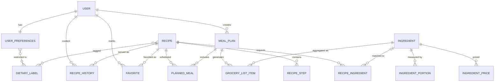

# Forkast Backend

Spring Boot API for Forkast. It owns all data access: recipes, ingredient matching, nutrition, pricing, dietary labels, meal plan generation, and grocery lists.

> **Status:** the data model, Flyway migrations (V1 to V3), and authentication are complete. Live endpoints: `GET /api/health`, the 11 `/api/auth/*` routes, and `GET`/`DELETE /api/users/me`.

## Local Setup

### Prerequisites

- JDK 17 or newer (must match `java.version` in `pom.xml`)
- A Supabase project (or any PostgreSQL database)
- VS Code with the Extension Pack for Java and Spring Boot Extension Pack (optional)

### Database configuration

Create `src/main/resources/application-local.properties`. This file is gitignored and must never be committed.

```properties
spring.datasource.url=jdbc:postgresql://<session-pooler-host>:5432/postgres
spring.datasource.username=postgres.<project-ref>
spring.datasource.password=<db-password>

spring.jpa.hibernate.ddl-auto=validate
spring.jpa.show-sql=true

# Generate with: openssl rand -base64 32
forkast.auth.jwt-secret=<base64 secret, at least 32 bytes>
```

The committed `application.properties` contains:

```properties
spring.profiles.active=local
spring.jpa.open-in-view=false

forkast.auth.access-token-ttl=15m
forkast.auth.refresh-token-ttl=90d
forkast.auth.code-ttl=15m
forkast.auth.code-max-attempts=5
```

Notes:

- Use Supabase's **Session pooler** connection. The direct connection is IPv6-only on the free tier, and the transaction pooler conflicts with JDBC prepared statements.
- Disable Supabase's Data API. This backend owns all data access.
- `ddl-auto` must stay `validate`. Flyway owns the schema; Hibernate only checks that entities match it.
- The app refuses to start if `forkast.auth.jwt-secret` is missing or shorter than 32 bytes.
- The `local` profile enables `LoggingEmailService`, which prints verification and reset codes to the console instead of sending email. Without the `local` profile there is no email service yet, so the app will not start.

### Run

From this folder:

```bash
./mvnw spring-boot:run        # Git Bash / macOS / Linux
mvnw.cmd spring-boot:run      # Windows cmd/PowerShell
```

On startup, Flyway applies any pending migrations to an empty database, so no manual schema setup is needed. Verify at `http://localhost:8080/api/health`.

## Schema Management (Flyway)

The schema is defined by versioned SQL migrations in `src/main/resources/db/migration/`:

| Migration                      | Contents                                                                                              |
| ------------------------------ | ----------------------------------------------------------------------------------------------------- |
| `V1__initial_schema.sql`       | All 16 domain tables, constraints, indexes, and foreign keys                                          |
| `V2__auth.sql`                 | `users.is_verified`, `password_changed_at`, `last_login_at`; `refresh_tokens` and `auth_codes` tables |
| `V3__cascade_user_deletes.sql` | Foreign keys to `users` (and their children) cascade on delete, for account deletion                  |

On startup, Flyway runs any migrations not yet recorded in the `flyway_schema_history` table, in version order. Hibernate then runs with `ddl-auto=validate` and refuses to start if an entity doesn't match the schema.

### Making a schema change

1. Add a new file: `V<next number>__<description>.sql` (capital V, two underscores), e.g. `V2__add_recipe_source_url.sql`.
2. Write the SQL (`alter table`, `create index`, seed `insert`s, etc.).
3. Update the matching entity.
4. Restart. Flyway applies the migration, then Hibernate validates the entity against it.

### Rules

- **Never edit a migration that has been applied** to any database you can't freely wipe. Flyway checksums each file and fails on startup if an applied one changes. Fix mistakes with a new migration.
- **Enum columns have check constraints** (e.g. `meal_slot in ('BREAKFAST','LUNCH','DINNER')`). Adding an enum value in Java also needs a migration that drops and recreates the constraint.
- **Foreign key columns are not indexed automatically** in Postgres. Add indexes in a migration if lookups by parent become slow.

### Resetting a local database

Drop every table in `public`, including `flyway_schema_history`, then restart. Flyway rebuilds the schema from V1 onward.

## Package Structure

```
src/main/java/com/forkast/backend/
├── auth/         AuthController, AuthService, TokenService, AuthCodeService,
│                 JwtAuthenticationFilter, AuthProperties, AuthenticatedUser,
│                 RefreshToken, AuthCode, AuthCodeType + repositories, dto/
├── common/       ValidationUtils, TokenHasher, MessageResponse,
│                 exception/ApiException, exception/GlobalExceptionHandler
├── config/       SecurityConfig, SecurityErrorHandler, JwtConfig
├── diet/         DietaryLabel, DietaryLabelRepository
├── favorite/     Favorite, FavoriteRepository
├── history/      RecipeHistory, RecipeHistoryRepository
├── ingredient/   Ingredient, IngredientPortion, IngredientPrice, PriceSource,
│                 IngredientRepository, IngredientPriceRepository
├── mealplan/     MealPlan, PlannedMeal, GroceryListItem, MealSlot, MealPlanRepository
├── email/        EmailService, LoggingEmailService (local profile)
├── recipe/       Recipe, RecipeStep, RecipeIngredient, RecipeRepository
├── user/         User, UserPreferences, UserRepository, UserPreferencesRepository,
│                 UserController, UserService, dto/
├── BackendApplication.java
└── HealthController.java

src/main/resources/
├── application.properties
├── application-local.properties   (gitignored)
└── db/migration/                  Flyway migrations
```

Code is organized **by feature**, not by layer. Each package will hold its own entities, repositories, services, controllers, and DTOs.

## Data Model

16 domain tables: 14 entity classes plus 2 plain join tables (`user_dietary_restrictions`, `recipe_dietary_labels`). Auth adds 2 more (`refresh_tokens`, `auth_codes`), described under Authentication.



### Modeling conventions

- **UUID primary keys** on every entity.
- **Protected no-arg constructor** for JPA; a public constructor takes only required fields, and optional fields use setters.
- **Setters validate** input through `common/ValidationUtils` (`requireText`, `trimToNull`, `requirePositive`, `requireNonNull`).
- **All `@ManyToOne` / `@OneToOne` relationships are lazy.**
- **Enums are stored as strings** (`@Enumerated(EnumType.STRING)`), never ordinals.
- **Money and quantities use `BigDecimal`**, never `double`.
- **Parent-owned children** (steps, recipe ingredients, portions, planned meals, grocery items) use `cascade = ALL` + `orphanRemoval`, with `add`/`remove` helpers on the parent that keep both sides in sync. Child setters for the parent are package-private.
- **Unbounded or shared relationships are one-way.** `User` and `Recipe` have no collections of favorites, history, or plans, and `Ingredient` has no price collection; those are queried through repositories.
- **Collection getters return unmodifiable views**, so changes go through helper methods.
- **Historical records are immutable** (`IngredientPrice`, `Favorite`, `RecipeHistory`): no setters, `updatable = false` columns. A changed price is a new row.

### user

**User** (`users`)

| Field                 | Type    | Notes                                                 |
| --------------------- | ------- | ----------------------------------------------------- |
| id                    | UUID    | PK                                                    |
| firstName             | String  | not null                                              |
| lastName              | String  | not null                                              |
| email                 | String  | unique, not null, trimmed and lowercased              |
| passwordHash          | String  | not null                                              |
| premium               | boolean | column `is_premium`, not null, default false          |
| verified              | boolean | column `is_verified`, not null, default false         |
| passwordChangedAt     | Instant | nullable; access tokens issued before it are rejected |
| lastLoginAt           | Instant | nullable                                              |
| createdAt / updatedAt | Instant | automatic timestamps                                  |

**UserPreferences** (`user_preferences`, 1:1 with User)

| Field                 | Type               | Notes                                               |
| --------------------- | ------------------ | --------------------------------------------------- |
| id                    | UUID               | PK                                                  |
| user                  | User               | FK `user_id`, unique, not null                      |
| weeklyBudget          | BigDecimal(10,2)   | not null; source of truth for budgeting             |
| householdServingSize  | int                | not null, default 1                                 |
| maxCaloriesPerMeal    | Integer            | nullable = no limit                                 |
| maxCaloriesPerDay     | Integer            | nullable                                            |
| proteinTargetGrams    | Integer            | nullable                                            |
| carbsTargetGrams      | Integer            | nullable                                            |
| fatTargetGrams        | Integer            | nullable                                            |
| repeatAvoidanceDays   | int                | not null, default 14; checked against RecipeHistory |
| dietaryRestrictions   | Set\<DietaryLabel> | M:N via `user_dietary_restrictions`                 |
| createdAt / updatedAt | Instant            | automatic timestamps                                |

### diet

**DietaryLabel** (`dietary_labels`): `id`, `name` (unique, not null, trimmed). Shared by UserPreferences and Recipe, so it lives in its own package. Labels are assigned to recipes at ingestion by a rule-based classifier (see Services).

### recipe

**Recipe** (`recipes`)

| Field                 | Type                    | Notes                                               |
| --------------------- | ----------------------- | --------------------------------------------------- |
| id                    | UUID                    | PK                                                  |
| name                  | String                  | not null                                            |
| description           | String (text)           | nullable                                            |
| prepTimeMinutes       | Integer                 | nullable, non-negative                              |
| cookTimeMinutes       | Integer                 | nullable, non-negative                              |
| totalTimeMinutes      | Integer                 | **derived** in the getter (prep + cook), not stored |
| baseServings          | int                     | not null, at least 1, not updatable                 |
| notes                 | String (text)           | nullable                                            |
| steps                 | List\<RecipeStep>       | ordered by stepNumber                               |
| ingredients           | List\<RecipeIngredient> |                                                     |
| dietaryLabels         | Set\<DietaryLabel>      | M:N via `recipe_dietary_labels`                     |
| createdAt / updatedAt | Instant                 | automatic timestamps                                |

**RecipeStep** (`recipe_steps`): `id`, `recipe` (FK), `stepNumber` (int, at least 1), `instructionText` (text, not null). Unique on `(recipe_id, step_number)`.

**RecipeIngredient** (`recipe_ingredients`): a join entity with extra columns.

| Field                 | Type             | Notes                                             |
| --------------------- | ---------------- | ------------------------------------------------- |
| id                    | UUID             | PK                                                |
| recipe                | Recipe           | FK, not null                                      |
| ingredient            | Ingredient       | FK, **nullable** (unmatched rows pending review)  |
| amount                | BigDecimal(10,3) | **nullable** ("salt to taste"); positive when set |
| unit                  | String           | not null                                          |
| optional              | boolean          | column `is_optional`, default false               |
| prepNote              | String           | nullable (chopped, room temperature, etc.)        |
| rawText               | String (text)    | not null; the original unparsed line              |
| needsReview           | boolean          | default false; true on construction until matched |
| createdAt / updatedAt | Instant          | automatic timestamps                              |

Matching is done through `matchIngredient(ingredient)` (links and clears `needsReview`) and `unmatchIngredient()` (unlinks and flags for review), so the two fields can't disagree. The same ingredient may appear twice in one recipe (e.g. sugar in dough and glaze), so there is no unique constraint on `(recipe_id, ingredient_id)`.

### ingredient

**Ingredient** (`ingredients`): the FoodData Central-backed catalog.

| Field                 | Type                     | Notes                                           |
| --------------------- | ------------------------ | ----------------------------------------------- |
| id                    | UUID                     | PK                                              |
| fdcId                 | Long                     | unique, nullable (custom ingredients have none) |
| name                  | String                   | not null                                        |
| caloriesPer100g       | BigDecimal(7,2)          | nullable = unknown                              |
| proteinGPer100g       | BigDecimal(7,2)          | nullable                                        |
| carbsGPer100g         | BigDecimal(7,2)          | nullable                                        |
| fatGPer100g           | BigDecimal(7,2)          | nullable                                        |
| portions              | List\<IngredientPortion> | ordered by gram weight                          |
| createdAt / updatedAt | Instant                  | automatic timestamps                            |

**IngredientPortion** (`ingredient_portions`): `id`, `ingredient` (FK), `description` (e.g. "1 cup, chopped"), `gramWeight` (BigDecimal(8,2), positive). Unique on `(ingredient_id, description)`. This is the density table for volume-to-mass conversion, sourced from FDC `foodPortions`.

**IngredientPrice** (`ingredient_prices`): immutable price observation.

| Field      | Type             | Notes                                                    |
| ---------- | ---------------- | -------------------------------------------------------- |
| id         | UUID             | PK                                                       |
| ingredient | Ingredient       | FK, not null                                             |
| storeName  | String           | nullable                                                 |
| price      | BigDecimal(10,2) | positive                                                 |
| quantity   | BigDecimal(10,3) | positive; the amount the price buys                      |
| unit       | String           | not null                                                 |
| currency   | String(3)        | ISO code, uppercased                                     |
| source     | PriceSource      | `OPEN_PRICES` or `MANUAL`                                |
| recordedAt | Instant          | when the price was observed (not when the row was saved) |

Indexed on `(ingredient_id, recorded_at)`. `IngredientPrice.manual(...)` is a factory for user-entered prices (USD, `MANUAL`, now). Open Prices data is barcode-level and needs its own fuzzy match to `Ingredient`, separate from the FDC match.

### favorite

**Favorite** (`favorites`): immutable. `id`, `user` (FK), `recipe` (FK), `createdAt`. Unique on `(user_id, recipe_id)`. Unfavoriting deletes the row.

### history

**RecipeHistory** (`recipe_history`): immutable. `id`, `user` (FK), `recipe` (FK), `servedAt` (passed in, not automatic). Indexed on `(user_id, served_at)`. Powers the repeat-avoidance window and variety analytics.

### mealplan

**MealPlan** (`meal_plans`)

| Field                 | Type                   | Notes                                                      |
| --------------------- | ---------------------- | ---------------------------------------------------------- |
| id                    | UUID                   | PK                                                         |
| user                  | User                   | FK, not null                                               |
| weekStartDate         | LocalDate              | not null, not updatable                                    |
| budgetTarget          | BigDecimal(10,2)       | nullable; snapshot of the weekly budget at generation time |
| mealPrepMode          | boolean                | column `is_meal_prep_mode`, default false                  |
| plannedMeals          | List\<PlannedMeal>     | returned sorted Monday to Sunday, breakfast to dinner      |
| groceryItems          | List\<GroceryListItem> |                                                            |
| createdAt / updatedAt | Instant                | automatic timestamps                                       |

Unique on `(user_id, week_start_date)`: one plan per user per week. `clearGroceryList()` supports regenerating the list after meals change.

**PlannedMeal** (`planned_meals`)

| Field             | Type                | Notes                          |
| ----------------- | ------------------- | ------------------------------ |
| id                | UUID                | PK                             |
| mealPlan          | MealPlan            | FK, not null                   |
| recipe            | Recipe              | FK, not null; swappable        |
| dayOfWeek         | java.time.DayOfWeek | stored as string               |
| mealSlot          | MealSlot            | `BREAKFAST`, `LUNCH`, `DINNER` |
| portionMultiplier | BigDecimal(5,2)     | positive, default 1            |

Unique on `(meal_plan_id, day_of_week, meal_slot)`: one recipe per slot. `moveTo(day, slot)` relocates a meal. In meal-prep mode, the generator will derive `portionMultiplier` as `householdServingSize × daysCovered ÷ baseServings`.

**GroceryListItem** (`grocery_list_items`)

| Field         | Type             | Notes                                                  |
| ------------- | ---------------- | ------------------------------------------------------ |
| id            | UUID             | PK                                                     |
| mealPlan      | MealPlan         | FK, not null                                           |
| ingredient    | Ingredient       | FK, not null                                           |
| totalAmount   | BigDecimal(10,3) | positive; grows via `addAmount()` when aggregating     |
| unit          | String           | not null                                               |
| estimatedCost | BigDecimal(10,2) | nullable until priced; non-negative                    |
| purchased     | boolean          | default false; `markPurchased()` / `markUnpurchased()` |

Unique on `(meal_plan_id, ingredient_id, unit)`, so shared ingredients combine into one line.

## Entity Helpers

Entity methods only touch data the entity (and its loaded associations) already holds. Anything that needs a repository, `PasswordEncoder`, or external API belongs in a service, because Hibernate creates entities outside Spring's bean lifecycle.

| Entity           | Implemented                                                                           | Planned                                                                                   |
| ---------------- | ------------------------------------------------------------------------------------- | ----------------------------------------------------------------------------------------- |
| Recipe           | `getTotalTimeMinutes()`, add/remove for steps, ingredients, labels                    | `scaleIngredientsTo(servings)`, `nutritionPerServing()`, `matchesAllRestrictions(labels)` |
| RecipeIngredient | `matchIngredient()`, `unmatchIngredient()`, `markNeedsReview()`                       | `scaledAmount(multiplier)`, `convertTo(unit)`, `nutritionContribution()`                  |
| Ingredient       | `addPortion()`, `removePortion()`                                                     | `gramsForPortion(description)`, `gramWeightForUnit(unit)`                                 |
| IngredientPrice  | `manual(...)` factory                                                                 | `isStale(maxAge)`                                                                         |
| UserPreferences  | add/remove dietary restriction                                                        | `hasNutritionConstraints()`, `isCompatibleWith(recipe)`, `perMealBudget(mealCount)`       |
| MealPlan         | `getEstimatedTotalCost()`, `isOverBudget()`, `clearGroceryList()`, add/remove helpers | `totalNutrition()`                                                                        |
| PlannedMeal      | `moveTo(day, slot)`                                                                   | `scaledServings()`, `nutritionTotal()`                                                    |
| GroceryListItem  | `addAmount()`, `markPurchased()`, `markUnpurchased()`                                 |                                                                                           |
| User             | `changePassword()`, `changeEmail()`, `markVerified()`, `recordLogin()`                |                                                                                           |
| RefreshToken     | `isExpired(now)`                                                                      |                                                                                           |
| AuthCode         | `isExpired(now)`, `isLocked(max)`, `recordFailedAttempt()`                            |                                                                                           |

Optional ingredients (`RecipeIngredient.optional = true`) will be excluded from grocery aggregation, cost totals, and nutrition totals, and listed separately as optional additions.

## Repositories

| Repository                | Custom queries                                                                                                        |
| ------------------------- | --------------------------------------------------------------------------------------------------------------------- |
| UserRepository            | `findByEmail`, `existsByEmail`                                                                                        |
| UserPreferencesRepository | `findByUserId`, `existsByUserId`                                                                                      |
| DietaryLabelRepository    | `findAllByOrderByNameAsc`, `findByNameIgnoreCase`                                                                     |
| RecipeRepository          | `findByNameContainingIgnoreCase` (filtered, paginated search planned)                                                 |
| IngredientRepository      | `findByFdcId`, `findByNameIgnoreCase`                                                                                 |
| IngredientPriceRepository | `findFirstByIngredientIdOrderByRecordedAtDesc` (latest price), `findByIngredientIdOrderByRecordedAtDesc` (history)    |
| FavoriteRepository        | `findByUserIdOrderByCreatedAtDesc`, `existsByUserIdAndRecipeId`, `deleteByUserIdAndRecipeId`                          |
| RecipeHistoryRepository   | `findTop20ByUserIdOrderByServedAtDesc`, `findByUserIdAndServedAtAfter`, `findRecentRecipeIds` (JPQL, for the planner) |
| MealPlanRepository        | `findByUserIdAndWeekStartDate`, `existsByUserIdAndWeekStartDate`, `findByUserIdOrderByWeekStartDateDesc`              |
| RefreshTokenRepository    | `findByTokenHash`, `deleteAllByUserId` (single `DELETE`)                                                              |
| AuthCodeRepository        | `findByUserIdAndType`, `deleteByUserIdAndType` (single `DELETE`)                                                      |

Child entities (RecipeStep, RecipeIngredient, IngredientPortion, PlannedMeal, GroceryListItem) have no repositories; they are saved through their parent via cascade.

## Services

Built:

- `AuthService`: signup, verification, login, refresh, logout, password reset and update, email change.
- `TokenService`: signs access JWTs, issues, rotates and revokes refresh tokens.
- `AuthCodeService`: issues and consumes 6-digit codes; failed attempts commit in their own transaction (`REQUIRES_NEW`, `noRollbackFor`) so they survive the error.
- `UserService`: current user, `UserResponse` mapping, account deletion.

Planned:

- `IngredientPricingService`: latest-price lookups and cost estimates (`estimatedCostFor`, per-meal and grocery pricing).
- `DietaryLabelClassifier`: ingest-time decision tree. Exclusion lists per label (e.g. vegan fails on any meat, dairy, or egg) plus nutrition thresholds (e.g. high-protein above a protein-per-serving cutoff).
- `RecipeIngestService`: parsing, matching, and persistence for scraped recipes (see below).
- `MealPlanGeneratorService`: the constraint-satisfaction planner.

## Recipe Ingestion (server side, planned)

The request and response contract is documented in [../data_pipeline/README.md](../data_pipeline/README.md). For each recipe received, `RecipeIngestService` will:

1. Skip duplicates by `sourceUrl`.
2. Persist the `Recipe` and its `RecipeStep`s.
3. Parse each raw ingredient line (quantity, unit, name, optional flag, prep note) with regex, plus a tagger-style fallback for messy lines.
4. Fuzzy-match ingredient names against `Ingredient` with Postgres `pg_trgm`. Low-confidence matches are saved with `ingredient = null` and `needsReview = true`, keeping `rawText`.
5. Run the `DietaryLabelClassifier` against the matched ingredients and computed nutrition.

Nutrition is never taken from the scrape. It is computed from matched `Ingredient` rows so there is a single source of truth. Ingestion is synchronous for v1.

## Authentication

Short-lived JWT access tokens plus hashed, database-stored refresh tokens, one per device. The full design and its reasoning are in the Forkast Auth Plan doc.

| Item               | Rule                                                                                                                                         |
| ------------------ | -------------------------------------------------------------------------------------------------------------------------------------------- |
| Access token       | JWT HS256, 15 minutes, claims `sub` (user id), `iat`, `exp`; sent as `Authorization: Bearer <token>`                                         |
| Refresh token      | 32 random bytes as hex, SHA-256 stored, 90 days, sent in the request body; rotated on every refresh                                          |
| Codes              | 6 digits emailed for verification, password reset and email change; SHA-256 stored, 15 minutes, locked after 5 wrong tries                   |
| Passwords          | BCrypt strength 12, 8 to 72 characters                                                                                                       |
| Session revocation | Password reset, password update and account deletion end every refresh token; access tokens issued before `password_changed_at` are rejected |
| Enumeration        | Resend-verification and forgot-password always return the same 202                                                                           |

**Request flow:** `JwtAuthenticationFilter` reads the Bearer token, verifies it with `JwtDecoder`, loads the user and checks `password_changed_at`. A valid token becomes an `AuthenticatedUser` principal (`@AuthenticationPrincipal` in controllers); an invalid one leaves the request unauthenticated. `SecurityConfig` then allows the public routes and requires authentication for everything else, so new routes are protected by default.

**Errors:** every error is an RFC 9457 ProblemDetail (`application/problem+json`) from `GlobalExceptionHandler`; validation failures add an `errors` map. Security rejections (401/403) are routed through `SecurityErrorHandler` to the same handler. A wrong current password returns 400, never 401, so the app's "401 means refresh" logic is not triggered.

**Tables:**

- `refresh_tokens`: `id`, `user_id` (cascade), `token_hash` (unique), `expires_at`, `created_at`.
- `auth_codes`: `id`, `user_id` (cascade), `type` (`EMAIL_VERIFY`, `PASSWORD_RESET`, `EMAIL_CHANGE`), `code_hash`, `new_email`, `attempts`, `expires_at`, `created_at`; unique on `(user_id, type)`.

## API Routes

| Method | Path                                       | Auth    | Handler               | Status                                    |
| ------ | ------------------------------------------ | ------- | --------------------- | ----------------------------------------- |
| GET    | /api/health                                | Public  | HealthController      | **live**                                  |
| POST   | /api/auth/signup                           | Public  | AuthController        | **live** (201)                            |
| POST   | /api/auth/verify-email                     | Public  | AuthController        | **live**                                  |
| POST   | /api/auth/resend-verification              | Public  | AuthController        | **live** (202)                            |
| POST   | /api/auth/login                            | Public  | AuthController        | **live**                                  |
| POST   | /api/auth/refresh                          | Public  | AuthController        | **live**                                  |
| POST   | /api/auth/logout                           | Public  | AuthController        | **live** (204)                            |
| POST   | /api/auth/forgot-password                  | Public  | AuthController        | **live** (202)                            |
| POST   | /api/auth/reset-password                   | Public  | AuthController        | **live**                                  |
| PATCH  | /api/auth/password                         | Bearer  | AuthController        | **live**                                  |
| POST   | /api/auth/email-change                     | Bearer  | AuthController        | **live** (202)                            |
| POST   | /api/auth/email-change/confirm             | Bearer  | AuthController        | **live**                                  |
| GET    | /api/users/me                              | Bearer  | UserController        | **live**                                  |
| DELETE | /api/users/me                              | Bearer  | UserController        | **live** (204)                            |
| PATCH  | /api/users/me                              | Bearer  | UserController        | planned (first and last name)             |
| GET    | /api/users/me/preferences                  | Bearer  | PreferenceController  | planned                                   |
| POST   | /api/users/me/preferences                  | Bearer  | PreferenceController  | planned (one-time, 1:1)                   |
| PATCH  | /api/users/me/preferences                  | Bearer  | PreferenceController  | planned                                   |
| GET    | /api/recipes                               | Public  | RecipeController      | planned (filters: labels, max time, text) |
| GET    | /api/recipes/{id}                          | Public  | RecipeController      | planned                                   |
| GET    | /api/recipes/{id}/scaled?servings=         | Public  | RecipeController      | planned                                   |
| POST   | /api/recipes/{id}/favorite                 | Bearer  | FavoriteController    | planned                                   |
| DELETE | /api/recipes/{id}/favorite                 | Bearer  | FavoriteController    | planned                                   |
| POST   | /api/admin/recipes/ingest                  | API key | IngestController      | planned                                   |
| GET    | /api/admin/recipe-ingredients/needs-review | API key | AdminController       | planned                                   |
| PATCH  | /api/admin/recipe-ingredients/{id}         | API key | AdminController       | planned (calls `matchIngredient`)         |
| POST   | /api/meal-plans/generate                   | Bearer  | MealPlanController    | planned                                   |
| GET    | /api/meal-plans                            | Bearer  | MealPlanController    | planned                                   |
| GET    | /api/meal-plans/{id}                       | Bearer  | MealPlanController    | planned                                   |
| GET    | /api/meal-plans/{id}/calendar              | Bearer  | MealPlanController    | planned                                   |
| DELETE | /api/meal-plans/{id}                       | Bearer  | MealPlanController    | planned                                   |
| GET    | /api/meal-plans/{id}/grocery-list          | Bearer  | GroceryListController | planned                                   |
| PATCH  | /api/grocery-list-items/{id}               | Bearer  | GroceryListController | planned                                   |

Controllers stay thin (bind, validate, delegate to a service). Success responses return the DTO with an explicit status; errors return ProblemDetail. Public recipe routes must be added to `SecurityConfig`'s public list when they are built; admin routes need an API-key filter.

## Open Questions

- [x] Grocery pricing comes from Open Prices with manual fallback, stored as `IngredientPrice` history.
- [x] Dietary labels are assigned by a rule-based classifier at ingestion.
- [x] Schema is managed by Flyway migrations, with Hibernate in `validate` mode.
- [ ] `Recipe` has no `sourceUrl` or `imageUrl` columns yet, but ingestion dedupes on `sourceUrl`. Add both in a migration before building ingestion.
- [ ] Units are plain strings. Adopt Indriya `Unit` types (with a converter) or a normalized unit enum?
- [ ] Round `portionMultiplier` quantities (e.g. 2.33 eggs) at read time in the service, or store pre-rounded?
- [ ] Allow more than one recipe per meal slot (main + side)? Currently one per slot.
- [ ] Normalize `weekStartDate` to Monday in the service?
- [x] Auth adapted from the existing Express flow for mobile: emailed codes instead of links, refresh token in the body, per-device sessions, account deletion instead of deactivation.
- [ ] Choose a production email provider, and send emails after the transaction commits.
- [ ] Rate-limit login and code endpoints before public launch.
- [ ] Scheduled cleanup of expired refresh tokens and auth codes.
